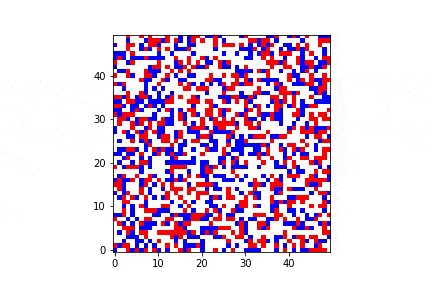

# Schelling's Segregation Model

[Schelling's segregation model](https://en.wikipedia.org/wiki/Schelling%27s_model_of_segregation) is the most famous agent-based model.

- Try to understand the model.
- Use python to generate a GIF image just like this one ([Wikipedia](https://en.wikipedia.org/wiki/File:Schellings.gif), [BY-CC-SA 4.0](https://creativecommons.org/licenses/by-sa/4.0/deed.en))

- Try to tweak the parameters and enjoy the effect. If you want, you may make an interactive version like [this one](https://demonstrations.wolfram.com/SchellingsModelOfResidentialSegregation/) or [this one](http://nifty.stanford.edu/2014/mccown-schelling-model-segregation/). Hint: you can take the advantage of Jupyter Notebook.